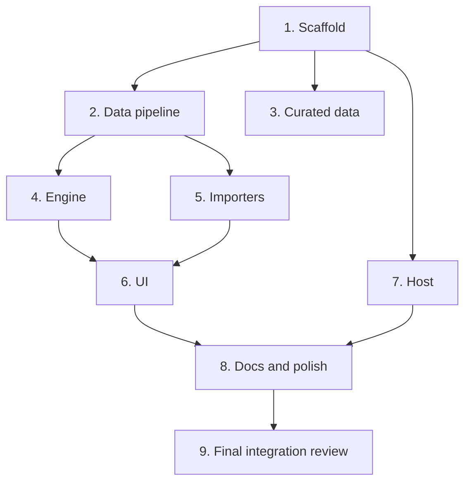

# Build Plan

Chronological execution plan for LoLDraftTool v1. Owner agents per the orchestration model: `coder` (Opus) for new production code and non-trivial changes, `writer` (Sonnet) for docs/simple edits, `chore` (Haiku/Sonnet) for mechanical work. See [architecture.md](architecture.md) for the stack and design this plan implements, and [discovery.md](../discovery.md) for the decisions behind it.

## Dependency graph

Parallelizable: steps 2 and 3 both depend only on step 1 and can run concurrently. Step 4 depends on step 2's generated *types*, not on step 3's curated *content* — it uses test fixtures instead, so 4 need not wait on 3. Step 7 depends only on step 1 and can run alongside 2-6. Step 8 starts once both 6 and 7 are done.

## Steps

### 1. Scaffold
- **Owner**: coder
- **Goal**: A working pnpm-workspace-less root with `app/` (Vite + React + TS), Vitest, a minimal ESLint flat config, `.gitignore`, `.editorconfig`, root `package.json` scripts, a placeholder platform adapter, and a passing smoke test.
- **Inputs**: [architecture.md](architecture.md) repository layout and stack sections.
- **Deliverables**: `app/` scaffold, root `package.json` with `dev`/`build`/`test` scripts, `app/src/platform/index.ts` stub.
- **Acceptance checks**: `pnpm i && pnpm test && pnpm build` exits 0.
- **Dependencies**: none.

### 2. Data pipeline
- **Owner**: coder
- **Goal**: `scripts/fetch-data.ts` (Node 24 via tsx) that fetches ddragon + cdragon + Meraki, merges them, and produces `app/public/data/champions.json` (all ~173 champions), champion square icons, and `meta.json`; `scripts/validate-data.ts`; TypeScript types in `app/src/data/types.ts`.
- **Inputs**: [research/data-sources.md §2-3](research/data-sources.md#2-riot-data-dragon-and-community-dragon) for exact URLs and merge keys; [data-schema.md](data-schema.md) for the target shape.
- **Deliverables**: `scripts/fetch-data.ts`, `scripts/validate-data.ts`, `app/src/data/types.ts`, generated `app/public/data/champions.json` + `meta.json` + icons.
- **Acceptance checks**: generated files exist; champion count ≥ 170; every champion has `positions` with at least one weight > 0; `pnpm validate-data` passes.
- **Dependencies**: step 1.

### 3. Curated data
- **Owner**: coder (requires LoL domain knowledge)
- **Goal**: `data/curated/tags.json` for every champion (behavioural tags, subclass, `blindSafe`/`counterSensitivity` per role, `flexRoles`), `data/curated/meta.json` tiers for patch 16.18, `data/curated/synergies.json` (~80-150 edges), `data/curated/counters.json` (~150-300 edges, focused on top/mid plus notable bot/support).
- **Inputs**: [data-schema.md](data-schema.md); [research/domain.md §5.2](research/domain.md#52-proposed-schema-conceptual-one-record-per-champion-role-specific-overrides-where-noted) and §6 worked example for calibration.
- **Deliverables**: the four curated JSON files above.
- **Acceptance checks**: `validate-data` passes; spot checks — Nocturne tagged `semiGlobal`; Shen tagged `global`; Galio tagged `semiGlobal` + `engage` + `counterEngage`; Janna `disengage: 3`; Poppy has an anti-dash reason in `counters.json` vs. Nocturne; Malphite counters AD top laners.
- **Dependencies**: step 1.

### 4. Engine
- **Owner**: coder
- **Goal**: draft state machine, role inference, profile/archetype detection, pick and ban scoring, explanation strings, and tests including scenario tests.
- **Inputs**: [architecture.md](architecture.md#engine-design) engine design section in full; step 2's `app/src/data/types.ts` (fixtures used in place of step 3's curated content).
- **Deliverables**: `app/src/engine/*.ts` and colocated `*.test.ts`.
- **Acceptance checks**: `pnpm test` green; engine coverage > 80% lines; the Nocturne+Galio+Shen scenario test passes as specified in [architecture.md](architecture.md#determinism--explainability).
- **Dependencies**: step 2 (types only).

### 5. Importers
- **Owner**: coder
- **Goal**: team pool JSON/CSV parser, opponents JSON/CSV/op.gg-paste parser, fuzzy champion-name resolution; sample files; tests.
- **Inputs**: [data-schema.md](data-schema.md) import formats; [research/data-sources.md §4](research/data-sources.md#4-opponent-import) for the op.gg paste pattern.
- **Deliverables**: `app/src/import/*.ts`, `data/samples/team-pool.json`, `data/samples/team-pool.csv`, `data/samples/opponents.json`, `data/samples/opponents.csv`.
- **Acceptance checks**: parser unit tests pass against the sample files; fuzzy name resolution test cases (`"Kaisa"` → Kai'Sa, `"MF"` → Miss Fortune) pass.
- **Dependencies**: step 2.

### 6. UI
- **Owner**: coder
- **Goal**: Setup and Draft screens per [architecture.md](architecture.md#ui-design), wired to the engine, with persistence, LoL-like styling, keyboard shortcuts, and the restart confirmation dialog.
- **Inputs**: [architecture.md](architecture.md#ui-design) UI design section.
- **Deliverables**: `app/src/ui/*.tsx`, `app/src/state/*.ts`.
- **Acceptance checks**: `pnpm build` passes; smoke test passes; manual walkthrough via the dev server, verified by the orchestrator with screenshots.
- **Dependencies**: steps 4 and 5.

### 7. Host
- **Owner**: coder
- **Goal**: `host/` WPF WebView2 project (`LoLDraftTool.Host.csproj`) that copies `app/dist` into `wwwroot` at build time, supports dev mode (pointed at `localhost:5173`), and has working publish scripts.
- **Inputs**: [architecture.md](architecture.md#stack) shell section; [research/tech-stack.md §6](research/tech-stack.md#6-fallback-plan-net-10-wpf--webview2-host-if-msvc-cannot-be-installed) for the exact WPF+WebView2 wiring.
- **Deliverables**: `host/` project, `host:run` and `host:publish` root scripts.
- **Acceptance checks**: `dotnet build host` exits 0; `dotnet run --project host` opens a window rendering the app, verified by the orchestrator.
- **Dependencies**: step 1.

### 8. Docs & polish
- **Owner**: writer
- **Goal**: README (setup, usage, import formats, legal notice), update the decisions log in [discovery.md](../discovery.md), document the sample files.
- **Inputs**: all prior deliverables; [research/data-sources.md §6](research/data-sources.md#6-licensing-summary) for the Legal Jibber Jabber text.
- **Deliverables**: `README.md`, updated `discovery.md`.
- **Acceptance checks**: every command in the README is run and verified to work.
- **Dependencies**: steps 6 and 7.

### 9. Final integration review
- **Owner**: orchestrator
- **Goal**: full draft run-through in both formats (Tournament, Ranked) and both sides (Blue, Red); produce a fix list for the `coder` agent.
- **Inputs**: the running app (host or dev server).
- **Deliverables**: a fix list, filed as follow-up tasks.
- **Acceptance checks**: n/a — this step produces the checks for the next iteration.
- **Dependencies**: step 8.
